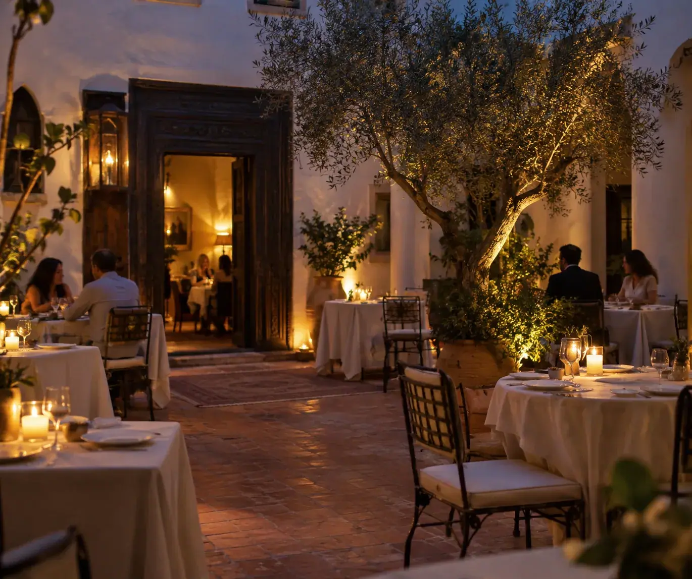

# TERRA — café · roastery · kitchen

A multi-page PHP website for a cozy, arch-and-sandstone café in Rajapark, Jaipur.
No framework, no build step, no database: plain PHP includes, one stylesheet, two scripts.



## What's inside

| Page | File | What it does |
| --- | --- | --- |
| Home | `index.php` | Full-screen hero, **360° virtual tour**, signature rail, menu teaser, roastery strip, spaces, gallery, reviews |
| Story | `story.php` | Manifesto, 2019 → 2026 timeline, house rules, the team |
| Menu | `menu.php` | All 25 plates, filter tabs by category, veg / non-veg marks |
| Roastery | `roastery.php` | Three single origins with roast meters, a V60 guide, subscriptions |
| Gallery | `gallery.php` | Filterable mosaic with a keyboard-friendly lightbox |
| Visit | `visit.php` | Hours, map, FAQ and a working reservation form (validates + mails) |

## The 360° tour

`index.php` embeds two real equirectangular panoramas — the Night Hall and the Reading Loft —
rendered with [Pannellum](https://pannellum.org) (MIT), bundled locally in
`assets/vendor/pannellum/`. Nothing loads until the visitor presses **Enter 360°**, so the
panoramas never slow the first paint. Hotspots move between rooms; drag, scroll to zoom,
or open it full screen. Phones with a gyroscope can tilt to look around.

Swap in your own café: shoot with an Insta360 / Ricoh Theta (or any phone panorama app that
exports 2:1 equirectangular), drop the files into `assets/pano/`, and edit the `data-scenes`
attribute on `#tour-stage` in `index.php`.

## Run it

```bash
# PHP 7.4 or newer
php -S localhost:8000
# then open http://localhost:8000
```

Or drop the folder into `htdocs/` (XAMPP) / `www/` (WAMP, Laragon) and visit
`http://localhost/terra-cafe/`. Any shared host with PHP works — upload and go.

## Editing

| I want to change… | Edit |
| --- | --- |
| Name, address, phone, email, map link | `includes/config.php` |
| Menu items, prices, categories, veg flags | `data/menu.php` |
| Gallery photos and captions | `data/gallery.php` |
| Colours, type, spacing | the token block at the top of `assets/css/style.css` |
| Navigation | `$nav` in `includes/config.php` + `includes/header.php` |
| 360° scenes and hotspots | `#tour-stage` in `index.php`, logic in `assets/js/tour.js` |

Colours live in CSS custom properties — butter `#F3C43F`, denim `#33507E`, sandstone `#EADDC7`,
espresso `#17110D`. Change those four and the whole site follows.

## Reservations

`visit.php` validates the form server-side and passes it to PHP's `mail()`. On a host without a
mail transport, replace that call with your SMTP library, a webhook, or an insert into your own
table — it is six lines near the top of the file.

## Performance

* Every photograph is WebP, sized for its slot (about 3.7 MB for the whole site).
* Panoramas load on demand only.
* No jQuery, no bundler, no external JS. Fonts come from Google Fonts; self-host them
  by dropping the files into `assets/` if you would rather not call out.
* Animations respect `prefers-reduced-motion`, and every interactive control is keyboard reachable.

## Structure

```
terra-cafe/
├── index.php  story.php  menu.php  gallery.php  roastery.php  visit.php
├── includes/   config.php  header.php  footer.php
├── data/       menu.php  gallery.php
├── assets/
│   ├── css/style.css
│   ├── js/main.js  js/tour.js
│   ├── img/*.webp
│   ├── pano/hall.webp  pano/loft.webp  (+ -sm versions)
│   └── vendor/pannellum/
├── README.md   LICENSE   .gitignore
```

## Credits & licence

Site code: MIT (see `LICENSE`). Pannellum: MIT, licence bundled alongside it.

The photographs and panoramas shipped here are stand-ins for a real shoot — they come from
open-source demo projects and free-licence collections, and are included so the site looks
finished on first run. Replace them with the café's own photography before going live.
